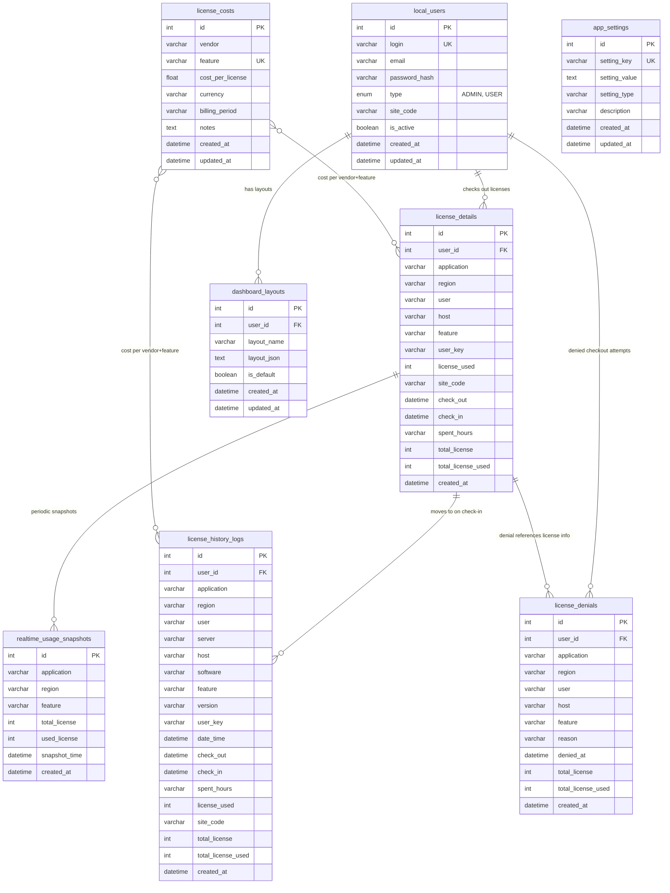

# License Tracker - Entity Relationship Diagram

## Data Flow

```
User checks out license  ──►  license_details (ACTIVE / LIVE usage)
                                     │
User checks in license   ──►  record moves to license_history_logs (HISTORICAL)
                                     │
User denied a license    ──►  license_denials (links user + license info)
                                     │
Scheduler (every 5 min)  ──►  realtime_usage_snapshots (periodic snapshot of license_details)
```



## Relationships

- **local_users → license_details**: Users check out licenses. `license_details` holds all currently **active/live** checkouts
- **license_details → license_history_logs**: When a user checks a license back in, the record **moves** from `license_details` to `license_history_logs` (completed usage)
- **local_users → license_denials**: When a user attempts to check out a license but is denied (e.g. no licenses available), a denial record is created linking the **user** and the **license info** (application, feature, etc.)
- **license_details → realtime_usage_snapshots**: The scheduler periodically snapshots the current state of `license_details` into `realtime_usage_snapshots`
- **local_users → dashboard_layouts**: One user can have multiple dashboard layouts (FK: `user_id`)
- **license_costs → license_details / license_history_logs**: Cost data maps to vendor+feature combinations
- **app_settings**: Standalone configuration table (LDAP, AI keys, etc.)

## Lifecycle

1. **Check-out**: User requests a license → new row in `license_details` (check_out = now, check_in = NULL)
2. **Active usage**: License is in use → visible in live/realtime views, captured by scheduler snapshots
3. **Check-in**: User releases the license → `license_details` row gets check_in timestamp, spent_hours calculated, then record is copied to `license_history_logs` and removed from `license_details`
4. **Denial**: If no licenses are available when user requests one → `license_denials` row created with user info + license info + reason
